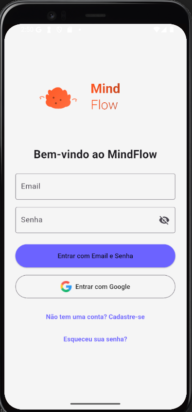
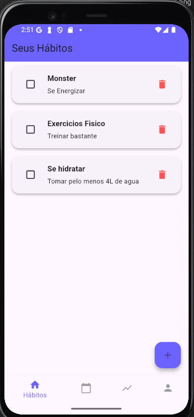
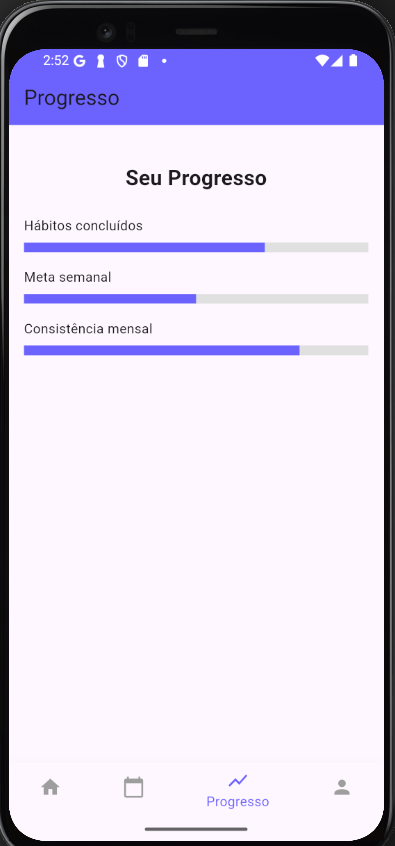
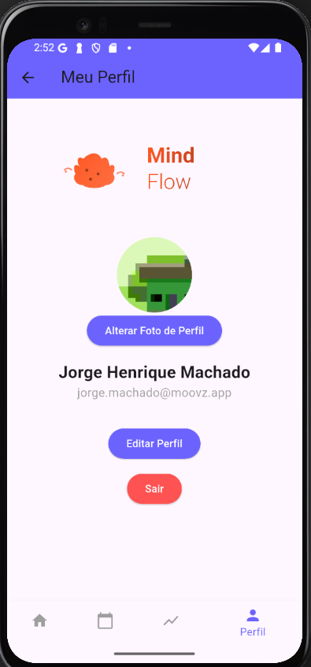

# 🧠 MindFlow

Aplicativo de **Controle de Hábitos e Desenvolvimento Pessoal**, feito em **Flutter + Firebase**, com foco em produtividade, bem-estar e organização de rotina.

## 📱 Screenshots
| Onboarding | Dashboard | Progresso | Perfil |
|:--:|:--:|:--:|:--:|
|  |  |  |  |

## 🚀 Funcionalidades

- ✅ Autenticação com **Email/Senha** e **Google**
- ✅ Tela de Onboarding
- ✅ Cadastro de hábitos com escolha de horário
- ✅ Notificações diárias dos hábitos
- ✅ Tela de progresso e calendário
- ✅ Perfil do usuário com foto, nome e bio
- ✅ Dados salvos no **Firebase Firestore**

---

## 🛠️ Tecnologias Utilizadas

- **Flutter + Dart**
- **Riverpod** (gerenciamento de estado)
- **Firebase Auth** (autenticação)
- **Cloud Firestore** (banco de dados)
- **Firebase Storage** (upload de fotos)
- **Local Notifications** (notificações diárias)
- **SVG Support** (`flutter_svg`)

---

## 🔥 Como rodar este projeto

1. Clone o repositório:

```bash
git clone
